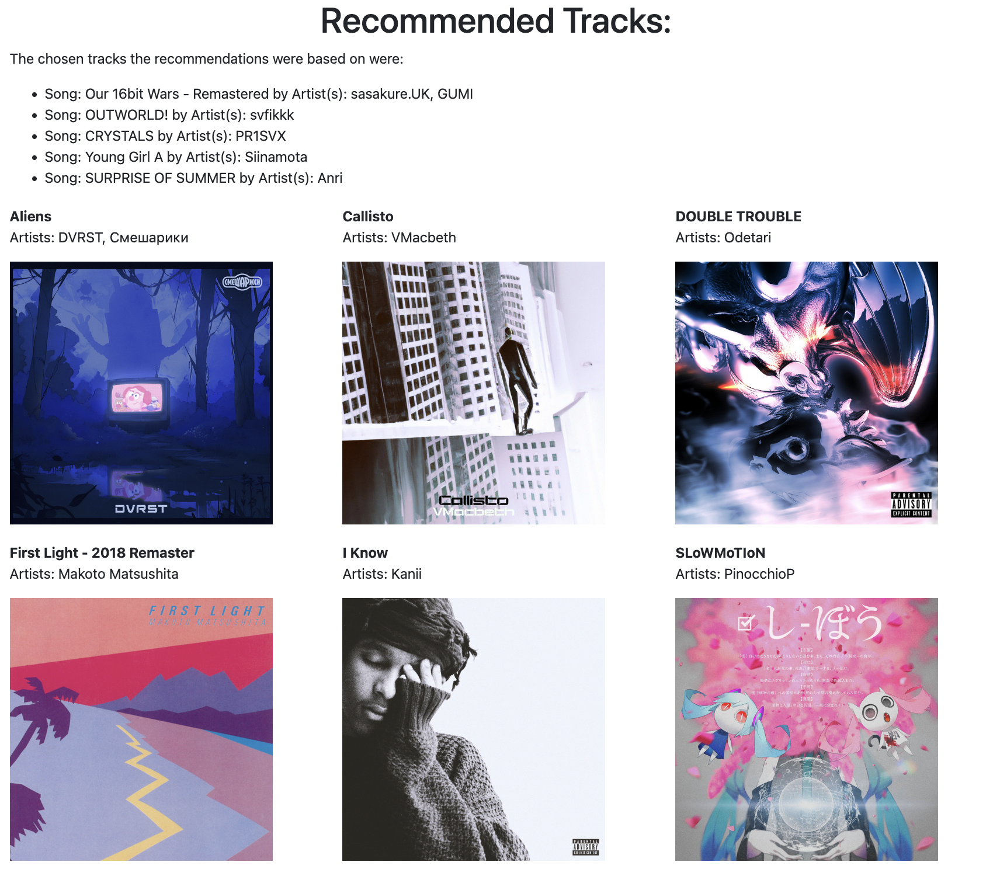

# SpotifyRecommendationAPP

A Webserver Application to generate personalized Spotify Song recommendations based on the user's top songs.


## Screenshots




## Getting Started


### Dependencies

* Dependencies are listed in the requirements.txt file
* Alternatively set up can be done by navigating to the project folder and running the setup.py script
   ```sh
  python setup.py install
  ```

### Installing


* Few modifications need to be made before the program can be run
  1. Get your own free Client API credentials at https://developer.spotify.com/
  2. In the app.py change
     ```sh
     CLIENT_ID = '<dummy_Client_ID>'
     CLIENT_SECRET = '<dummy_CLIENT_SECRET>'
     ```
     to
       ```sh
     CLIENT_ID = '<insert_your_client_id'
     CLIENT_SECRET = '<insert_your_client_secret'
     ```

### Executing program

* My actively running website can be found under http://williamzhang.eu.pythonanywhere.com/
* Note: only emails/spotify accounts that have been granted permission by me can use the website.
  
* Running the webserver on your own machine, after setting up as listed above, can be done as follows:
```
flask run
```

## Help

For any problems and issues. Feel free to open an issue or shoot me an email at williamyihaozhang@gmail.com

## Authors


William Zhang
[LinkedIn](https://www.linkedin.com/in/william-yihao-zhang-037b78238/)

## Acknowledgments

Inspiration, code snippets, etc.
* [Great Youtube Tutorial by Jason Goodison](https://www.youtube.com/watch?v=g6IAGvBZDkE&ab_channel=JasonGoodison)
* [SpotifyAPI doc](https://developer.spotify.com/documentation/web-api)
* [Spotipy Doc](https://spotipy.readthedocs.io/en/2.22.1/)

##Contributing
Pull requests are welcome! For major refactors, please open an issue first to discuss what you would like to improve. Feel free to create a fork of this repository and use the code for any noncommercial purposes.
